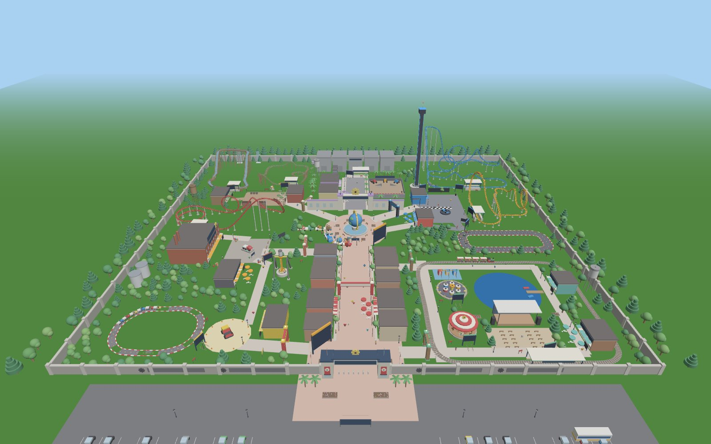

# Benton Diesel World

A Roblox theme park game: seven lands, 13 rides with live wait times, four
shows, seven shops and six restaurants.



*A preview of the park as the game builds it, rendered from the game's own
build code. Terrain, sky, lighting and sign text look much better in Roblox.*

---

## Play it in your browser (no Roblox needed)

The `web/` folder is a browser edition of the same park, built with three.js
from the Roblox game's own build code: same lands, rides, wait times, shows,
shops, restaurants, Benton Bucks and passport. Progress is saved in your
browser.

```bash
npm install
npm run export-web   # export the park from the Roblox build to web/public/park.json
npm run build-web    # bundle web/dist (index.html, game.js, park.json)
npm run serve-web    # open http://localhost:8080
```

Controls: WASD or arrows to walk, drag to look, wheel to zoom, Space to jump,
E to join a line or open a shop, F for an Express Pass, 1–3 to eat. On a phone,
use your left thumb to walk and drag anywhere else to look.

**Sound.** The browser edition makes all of its sound itself, with the Web
Audio API (no audio files):

- **Music for every land** that crossfades as you walk: a Main Street rag in
  Benton Plaza, garage blues in Diesel District, a toy-box tune in Little
  Haulers, bluegrass banjo in Backwoods Junction, big-band swing at the Movie
  Studios, synthwave in Velocity City and a lakeside waltz in Family Landing.
  It plays softer at night, and quieter while you ride or watch a show.
- **Rides:** coaster rumble, lift-hill chain clatter and riders screaming on
  the drops; the steam train's whistle and chuffs; kart and truck engines;
  the drop tower; the log flume splash; the carousel's band organ; boarding
  bells and the dispatch hiss.
- **Shows:** a song with a synthesized singing voice at Big Dreams Live!, stunt-show explosions
  and cheering crowds, a marching band that moves with the parade, and
  fireworks whistles, booms and crackles.
- **Ambience:** crowd chatter, birds by day, crickets at night, the Hub
  fountain, the lake and waterfalls, steam vents and campfires.
- **An announcer** (your browser's text-to-speech voice) for boarding, show
  starts and the stunt show.
- Mute with 🔊 in the top bar; set music and effects volume, or turn the
  announcer off, in ⚙ Settings.

## Play it in Roblox Studio

1. Download **[`BentonDieselWorld.rbxlx`](BentonDieselWorld.rbxlx)** from this
   folder.
2. Open **Roblox Studio** → **File → Open from File…** → pick
   `BentonDieselWorld.rbxlx`.
3. Press **Play** (F5).

The whole park is built by code when the game starts (about 2–3 seconds), so
in edit mode you'll only see a "Press PLAY" sign. That's normal. You spawn in
the parking lot at the front gate.

To publish it: **File → Publish to Roblox**. For saved progress (Benton Bucks,
souvenirs, passport stamps) in a published game, turn on **Game Settings →
Security → Enable Studio Access to API Services**. That also lets you test
saving in Studio.

## How to play

| Do this | How |
|---|---|
| Ride a ride | Walk up to the ride's entrance sign and press **E** (*Join Line*). Your guest walks into the queue and moves up with the line; you can also steer yourself. Walking out of the queue leaves the line. When it's your turn you're seated at the boarding gate. |
| Skip the line | Press **F** at an entrance to use a **Diesel Express Pass**. You walk past the line to the boarding gate. You start with one pass; buy more in the shops. |
| Check wait times | Use the **Wait Times** tab in the app (left side of the screen), or the big boards at the front gate and the Hub. |
| Get directions | Press **Guide me** on any ride, show or restaurant, or tap it on the **Map** tab. A glowing path leads you there. |
| Shop or eat | Press **E** at a shop or restaurant counter. Food goes in your backpack; click to take a bite. |
| See a show | Check the **Shows** tab for showtimes and stand in the audience area while it plays. |
| Wear souvenirs | Open **My Bag** to put on or take off hats, shades and balloons. |

**Benton Bucks (B$)** are earned by riding (+15, plus +35 for a new passport
stamp), finishing every ride in a land (+150), watching a show (+30), a daily
visit bonus (+100), and playing time (+10 every 2 minutes).

**Hunger** slowly goes down. When it reaches zero you walk slower, so eat
something. Coffee and the Turbo Shake give a speed boost, and Nitro Soda gives
a super jump.

### Park time and wait times

The park has its own clock (top bar). During the day, **one real second is one
park minute**, so a posted **25 min** wait really is about 25 seconds. Night
passes four times faster.

Every ride has a real queue line: a railed switchback maze by its entrance
sign, ending at a boarding gate. You stand in it alongside simulated guests,
and every guest in line is a real rider who boards the vehicles ahead of you,
so the posted wait matches the line you see. Each maze holds at least an hour
and a half of guests (up to about three hours), and longer lines spill out
past the sign. Waits are longest in the afternoon, when the big coasters
reach an hour or more. Rides sometimes go down for a minute
("Temporarily Closed"), and evenings are quieter.

Because a ride cycle takes 25–70 park minutes, an hour's wait is one or two
trainloads of guests: about 8–28 people in line, depending on the ride.

## What's in the park

Laid out like the concept map: front gate and parking lot at the south,
Main Street up to the Benton Globe fountain at the Hub, and the lands around
it.

| Land | Rides | Food & shops |
|---|---|---|
| **Benton Plaza** | – | Main Street Bakery, Main Gate Emporium |
| **Diesel District** | **Diesel Thunder** (steel coaster: loop and 540° helix), **Piston Pounder** (giant pendulum) | Fuel Up Canteen, Benton Garage Outfitters |
| **Little Haulers** | **Little Haulers Truck Trek** (kids' big rigs) | Little Haulers Toy Garage |
| **Backwoods Junction** | **Backwoods Rapids** (log flume, 40-stud drop), **Runaway Tow Truck** (family coaster) | The Pork Chop Diner, Tow & Repair Trading Post |
| **Benton Movie Studios** | **Studio Backlot Tram Tour** (fire, flood and explosion effects) | Studio Commissary, Studio Store |
| **Velocity City** | **Velocity Viper** (100-stud drop, two loops, zero-g roll), **Nitro Loop** (launch coaster), **Benton Tower Drop** (150-stud drop tower), **Velocity Speedway** (8-kart race) | Pit Stop Pizza, Victory Lane Gear |
| **Benton Family Landing** | **Lakeside Express** (steam train around the land), **Gearwheel Carousel**, **Spinning Pistons** (spinning cups) | The Depot Grill, Lakeside Gifts |

**Theming.** Every land is dressed with props placed by a search of the
built park for clear ground near the walkways: popcorn and balloon carts, a
vintage gas pump and string lights over Main Street; containers, a tower
crane, pipe runs, oil drums and steam vents in Diesel District; a toy digger,
letter blocks, cones and road signs in Little Haulers; a windmill, campfires,
log piles, lanterns and festoon lights in Backwoods Junction; searchlights, a
giant clapperboard, film reels, cameras, a red carpet and a walk of fame at
the Movie Studios; spinning show cars, a podium, tire barriers and neon in
Velocity City; and a lighthouse, a gazebo, rowboats, picnics and beach
umbrellas at Family Landing. The windmill, gears, film reels, show cars and
lighthouse lamp turn, and the searchlights and lighthouse beam light up at
night.

**Shows** (times are park time):

- **Big Dreams Live!** at the Lakeside Stage: dancers, stage lights, lake
  fountains and confetti. 10 AM, 12, 2, 4, 6 and 8 PM.
- **Diesel Stunt Spectacular** at the Backlot Stunt Arena: ramp jumps, a
  barrel roll, explosions and a wall of fire. 11 AM, 1, 3, 5 and 7 PM.
- **Big Rig Parade** around the Hub and down Main Street. 12:30 and 5:30 PM.
- **Benton Nights Fireworks** over the Benton Globe and Movie Studios.
  9:15 PM.

To start a show right away while testing in Studio: during Play, select
**ServerScriptService → BentonServer** and add a string attribute
**`StartShow`** set to `BigDreams`, `StuntSpectacular`, `BigRigParade` or
`BentonNights`. A string attribute **`CloseRide`** set to a ride id (for
example `DieselThunder`) closes that ride for 90 seconds.

## Changing the park

Everything is plain Luau in [`src/`](src):

| File | What it controls |
|---|---|
| `src/shared/Config.luau` | Lands, rides (positions, base wait, colors), shows and showtimes, shops and restaurants, economy and hunger numbers |
| `src/shared/Items.luau` | Every souvenir and menu item: names, prices, boosts |
| `src/shared/Layouts.luau` | Coaster and track layouts (control points, lift hills, launches, brakes) |
| `src/shared/Clock.luau` | Park hours and crowd curve |
| `src/server/Build/*` | The park's buildings and scenery, one file per area |
| `src/server/Build/Theming.luau` | Themed props for each land: what each prop looks like and where it stands |
| `src/shared/Sounds.luau` | Music and sound slots for the Roblox version (see below) |
| `src/shared/QueueLine.luau` | Where each ride's queue maze sits, its size, and the path guests stand along |
| `src/server/RideService.luau` | Queues, simulated guests, wait times, dispatching |
| `src/client/App.luau` | The on-screen Benton App |

There are no uploaded meshes, images or sounds. Everything is built from
parts, so nothing can break from missing assets.

**Sound in Roblox.** Roblox can only play audio from asset ids, so the
Roblox version uses a few sounds that come with every Roblox client (button
clicks, reward pings, the flume splash, firework launches; explosions make
their own sound). Music, show music, ride loops and screams are empty slots
in [`src/shared/Sounds.luau`](src/shared/Sounds.luau): paste in the ids of
audio you own or public audio from the Creator Store
(`"rbxassetid://123456"`) and each one plays in the right place. Land music
crossfades as you walk, show music plays at the venues, ride loops play on
the lead vehicle while the ride runs, and screams play on big drops.

### Working with Rojo (optional, for developers)

The folder is a [Rojo](https://rojo.space) project:

```bash
rojo serve          # live-sync src/ into an open Studio place
rojo build -o BentonDieselWorld.rbxlx
```

### Checks without Roblox

```bash
npm install
npm run check       # Luau type-check of every script against the Roblox API
npm test            # runs the real game scripts in a simulated Roblox and plays a guest's day
npm run build       # rebuilds BentonDieselWorld.rbxlx (needs rojo)
npm run build-web   # bundles the browser edition into web/dist
```

`npm test` boots the server, builds the park, and walks a guest through
queueing, riding, buying a hat and a coffee, eating, every app tab and the
shows. It also simulates four park hours. Every class, property, enum and
method it touches is validated against Roblox's official API dump
(`tools/mock`). `node tools/tracks.mjs` prints each ride's length, cycle
time, top speed and g-forces.

## Notes

- Ride vehicles and shows are animated on each player's screen in sync with
  the server clock, so they stay smooth for everyone. Riders are held in
  place by the server and moved with the car on every screen.
- Built for Workspace `StreamingEnabled = false` (set in the place file).
- Original fan creation; not affiliated with any real company or park.
